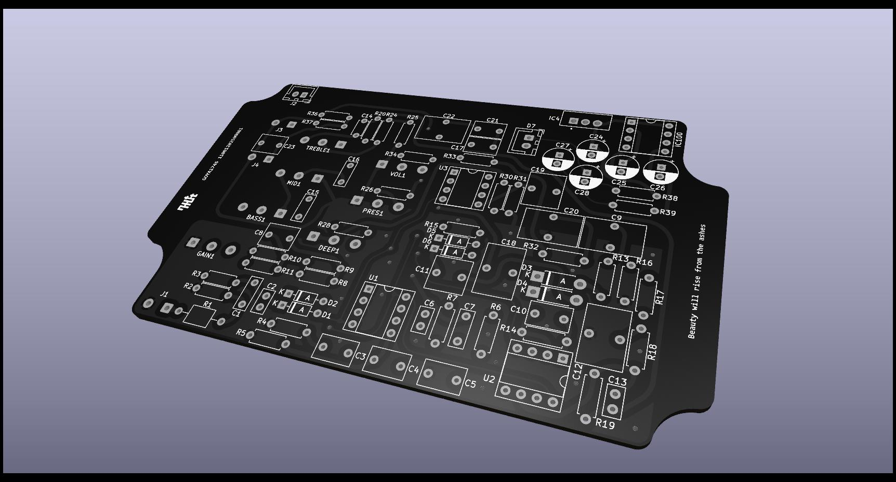
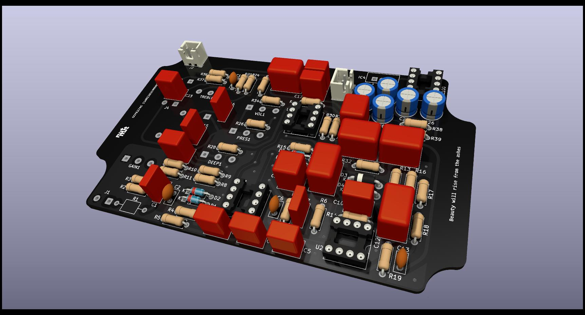
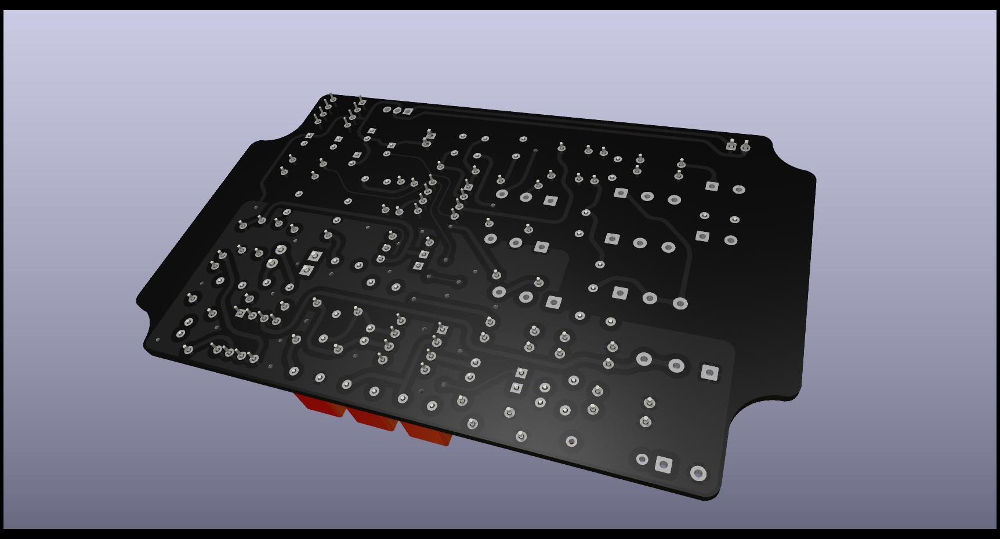
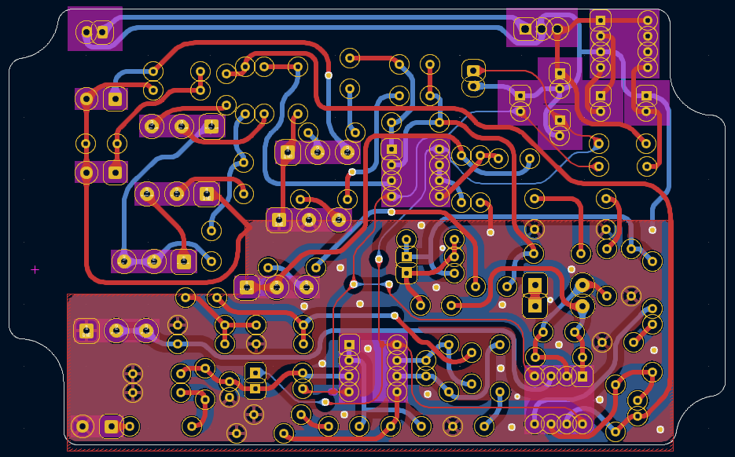

  <picture>
    <source media="(prefers-color-scheme: light)" srcset="docs/logo_terein_light.svg">
    
  </picture>

## Overview

**goya1746** is an overdrive & preamp pedal based on the legendary Diezel VH4 channel 3. Fully open circuit board designed in KiCad 8. The main idea was to avoid oscillations on all gain levels. This project is shared for hobbyists who want to study, modify, or build their own. The full PCB outline is 115 × 70 mm (4.53 × 2.76 in), but the usable area is about 96 × 70 mm (3.78 × 2.76 in) if you remove the side "wings" in KiCad and define your own edge cut before generating Gerbers. In theory, it should fit a 1590BB enclosure, but keep in mind that each potentiometer is wired separately and the connection pads are not located at the corners of the PCB, so there will be quite a lot of wiring inside.

## Manufacturing

Check [Releases](https://github.com/escaroda/goya1746/releases) page for `.zip` Gerber files ready for production.
If you want to fabricate the PCB, just upload the `.zip` Gerber files to your favorite board house (e.g. JLCPCB, PCBWay, NEXTPCB). Make sure you can source all components in the correct form factor before manufacturing the board.

## Important notes

- This pedal should be powered with 12-18VDC. Power draw 100mA. There are claims that 15VDC provides the best results because it generates less heat in the voltage regulator, but 18VDC is the standard.
- The LM2940 regulator is installed vertically. Its metal tab can be mounted to the chassis to help dissipate heat — just make sure the chassis is grounded and not connected to any other signal paths. This workaround increases build complexity and will be refined in a future revision. The goal was to minimize board temperature to prolong the lifespan of nearby electrolytic capacitors.
- Only five electrolytic capacitors are used, and they are strategically placed to provide shielding for the TC1044SCPA charge pump switching regulator IC from nearby components.
- Some capacitors, specifically C3, C4, C5, C9, C12, C17, C18, C20 and C22, that were originally electrolytic, have been replaced with film capacitors. The schematic remains unchanged, but the PCB footprints are different. You can still install electrolytic capacitors in those positions, but be sure to observe the correct polarity.
- The resistor 2.2K 1/4W for the LED 12V should be placed on the wire that connects it to the PCB. Adjust the resistor value to achieve the desired brightness.
- Even though the LM2940CT-12/NOPB voltage regulator provides reverse-polarity protection for the entire circuit, it is still good practice to solder a 1N5817 Schottky diode in series with the + wire leading to the DC input. The striped end (cathode) should face the PCB. For example: DC Jack → [Anode — Diode — Cathode] → PCB. You can see this approach used in almost all PedalPCB schematics. Make sure you identify the +V and Ground pins of the DC input by referring to the PCB design in KiCad.
- For experimental purposes, the mid-pot tone control is wired in the so-called "Marshall style," which gives the mid control a stronger effect and shifts the tone toward a punchier, more mid-rich sound compared to a "Fender style" tone stack. Future revisions may provide both options, allowing the choice to be independent of the PCB layout.
- Because of space limitations in this version, buffered bypass solder pads are not included. This may be added in a future revision. At the moment, the on/off switch must be wired as a true bypass by the builder. Or, if you're feeling hacky, you can connect a wire between the C3 capacitor and the R4 resistor (for example, to the side of the R4 resistor that isn’t connected to Ground), and that will be your buffer. And the signal after R17 should be shorted to Ground during bypass.

P.S. Future releases are not expected in the near term due to financial constraints. However, once the situation improves, development will continue, including projects such as Turbo Rat, SansAmp GT-2, Boss CE-2, as well as a search for the best fuzz circuit.

## Acknowledgments

- [Diezel](https://www.diezelamplification.com/artist/) for inspiring design of modern high-gain amplifiers.
- [freestompboxes.org](https://www.freestompboxes.org/viewtopic.php?t=28011) and its community — without their prior work, this project would not have been possible.
- [pedalpcb.com](https://www.pedalpcb.com/product/valhalla/) DIY shop, for inspiration and clear, easy-to-understand schematics.
- [aionfx.com](https://aionfx.com/project/dz4-preamp/) for showing how things can be changed.
- [pcbguitarmania.com](https://pcbguitarmania.com/product/benzin-vh4/) for yet another reference and food for thoughts.
- [effectslayouts.blogspot.com](https://effectslayouts.blogspot.com/2019/07/diezel-vh4.html) for better understanding how the footswitch wiring should work.
- [techexplorations.com](https://techexplorations.com/kicad/) for great KiCad educational materials.

## Bill of Materials

All resistors are 1/4 W metal film with 1% tolerance. All capacitors must have a minimum voltage rating of 35 V. Consider capacitors to be film unless otherwise specified. All ceramic capacitors exhibit some degree of piezoelectric effect, but C0G (also known as NP0) dielectrics have the lowest such effect and are recommended for this design. If 25 kΩ potentiometers are unavailable, a 50 kΩ potentiometer may be used together with a 50 kΩ resistor in parallel. This changes the taper slightly (especially for log pots), because the resistance curve is altered by the parallel resistor. Ferrite bead R1 is optional and can be replaced with a wire link. The OPA2134 at U1 may be substituted with another TL072 without any noticeable difference.

You'll also need:
- 6.3 mm jack sockets,
- DIP8 sockets for each op-amp and a charge pump,
- optional JST connectors for DC input and LED,
- a **plastic** DC input jack wired for center negative.

This pedal provides two output options: Guitar Out and Power Out. In most cases, you won’t need to wire both. If the pedal is used at the end of a signal chain (similar to a real amplifier), Power Out is the preferred choice. Power Out is a low-impedance, line-level signal, so it can be safely connected to standard line inputs, such as those on audio interface. Guitar Out is a traditional high-impedance output suitable for connecting to other pedals or amp inputs.

*For ICs and other essential components, use reputable suppliers only. Avoid sources like eBay or AliExpress, as counterfeit or unreliable parts are widespread on those platforms and may cause malfunction or failure.*

|Reference          |Value           |Qty|Notes                                           |
|-------------------|----------------|---|------------------------------------------------|
|BASS1              |A1M             |1  |                                                |
|C1,C7,C15,C16      |22n             |4  |                                                |
|C2,C6,C13          |100p            |3  |Ceramic C0G/NP0                                 |
|C3,C4,C5,C17       |1u              |4  |                                                |
|C8,C23             |2n2             |2  |                                                |
|C9,C12,C18         |2u2             |3  |                                                |
|C10                |47p             |1  |Ceramic C0G/NP0 or Film                         |
|C11                |4n7             |1  |                                                |
|C14                |560p            |1  |Ceramic C0G/NP0                                 |
|C19                |330n            |1  |                                                |
|C20,C22            |10u             |2  |                                                |
|C21                |1n              |1  |                                                |
|C24,C25,C26,C27,C28|47u             |5  |Electrolytic ~35V                               |
|D1,D2,D5,D6        |1N4148          |4  |Signal diode, DO-35                             |
|D3,D4              |1N4734A         |2  |5.6V zener (equivalents: 1N752, 1N5232), DO-41  |
|D7                 |LED 12V         |1  |Require ~2.2K resistor                          |
|J1                 |GUITAR INPUT    |1  |                                                |
|J2                 |DC INPUT        |1  |                                                |
|J3                 |POWER OUT       |1  |                                                |
|J4                 |GUITAR OUT      |1  |                                                |
|R1                 |FerriteBead     |1  |Optional                                        |
|R2,R3,R14          |1M              |3  |                                                |
|R4,R5,R15,R25,R37  |100K            |5  |                                                |
|R6,R13,R18,R33     |10K             |4  |                                                |
|R7,R10,R11,R17,R19 |220K            |5  |                                                |
|R8,R16             |470K            |2  |                                                |
|R9                 |680K            |1  |                                                |
|R20                |39K             |1  |                                                |
|R24                |1M5             |1  |                                                |
|R26,R34            |1K              |2  |                                                |
|R28                |100R            |1  |                                                |
|R30                |47R             |1  |                                                |
|R31                |56K             |1  |                                                |
|R32                |4K7             |1  |                                                |
|R36                |150K            |1  |                                                |
|R38,R39            |10R             |2  |                                                |
|U1                 |OPA2134         |1  |Dual op-amp, DIP8. May be substituted with TL072|
|U2,U3              |TL072           |2  |Dual op-amp, DIP8                               |
|IC4                |LM2940CT-12_NOPB|1  |Low-dropout voltage regulator +12V              |
|IC100              |TC1044SCPA      |1  |Charge Pump IC, DIP8                            |
|DEEP1,PRES1        |C25K            |2  |                                                |
|GAIN1              |A250K           |1  |                                                |
|MID1               |B25K            |1  |                                                |
|TREBLE1            |B250K           |1  |                                                |
|VOL1               |A10K            |1  |                                                |

## Ground & Shielding

The chassis should be properly grounded to ensure effective shielding and noise reduction. Where possible, use cables with an outer braided shield and connect the shield to ground at least on one end—preferably at the PCB side. The metal backs of potentiometers may also be connected to ground to help reduce noise pickup through their housings. Ground loops are generally not a concern inside a small enclosure such as a pedal, so a strict star-ground topology is unnecessary. The **DC input jack must be plastic** (isolated from the enclosure). Most pedals use a negative center power supply, so a metal jack touching the chassis could short the positive voltage to ground.

## PCB Specifications

- Layers: 2
- Thickness: 1.6 mm
- PCB Size: 115 x 70 mm (4.53 × 2.76 in)
- Copper weight: 1 oz (default PCB fab)
- Trace clearance: 6 mil or 0.1524mm
- Soldermask: [Black / Green / Anything]
- Silkscreen: [White]
- Surface finish: HASL
- Material: FR-4
- Via finish: Tented
- Min. Drill Hole: 0.3 mm
- Assembly: Through-hole components only (no SMD)

## Recommended Fabricators
- NEXTPCB
- JLCPCB
- PCBWay

## Gallery

## TODO

- Add a connection pad for the buffered output between C3 and R4, and find a suitable location for it on the PCB. Add a connection pad after R17 to be able to short it to Ground during bypass. Update schematic.
- Position the voltage regulator so that it can be laid flat on the PCB. Add a ground plane underneath it for better heat distribution.
- Add jumper to select mid-pot wiring between Marshall and Fender styles.
- Substitute all ceramic caps in favor of polypropylene film ones?

## License

This hardware design is distributed under the MIT License.
Copyright (c) 2025 Dmitry Escaroda.

## Contribution

If you build this pedal, feel free to share photos or mods via Discussions. If you are an experienced Electronics Engineer or PCB Designer and see how something could be improved for the benefit of all, please submit an issue.

